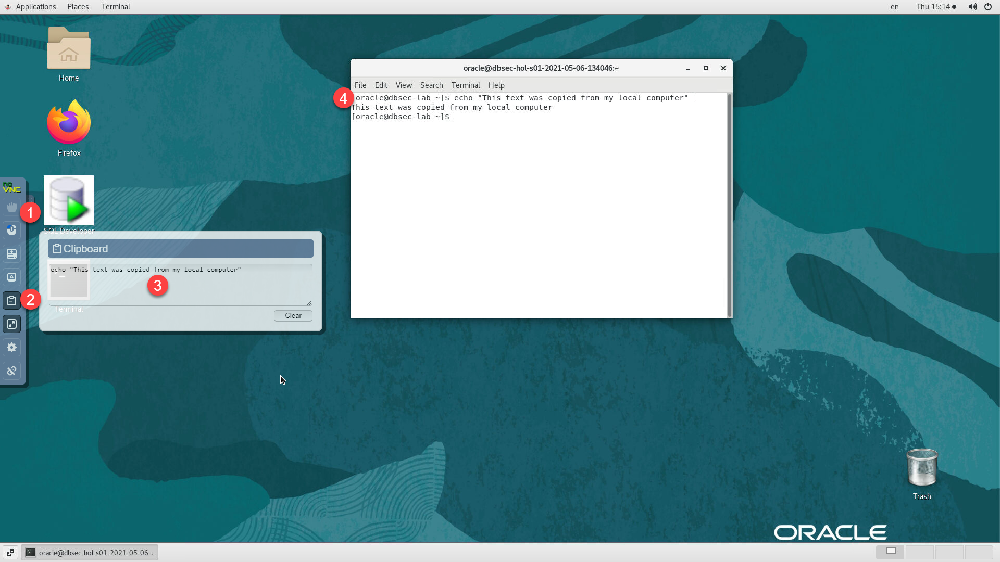
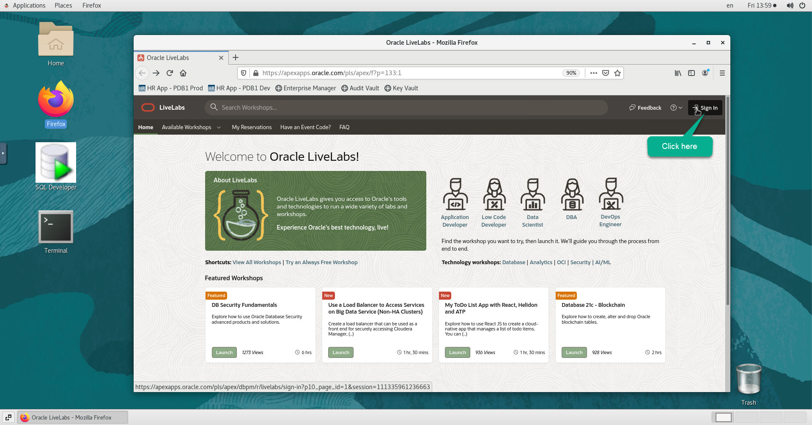
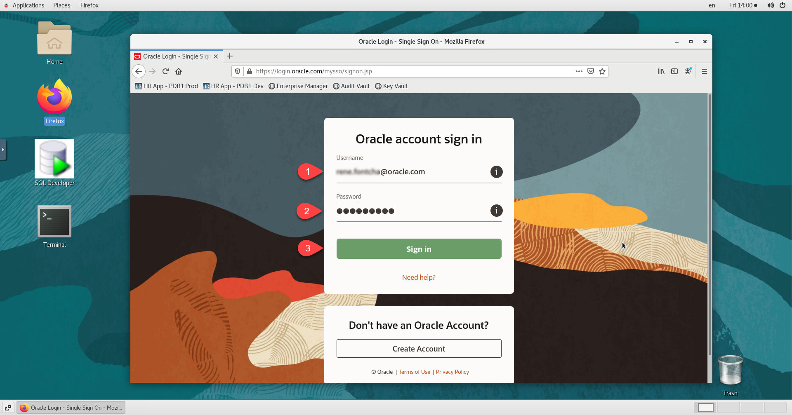
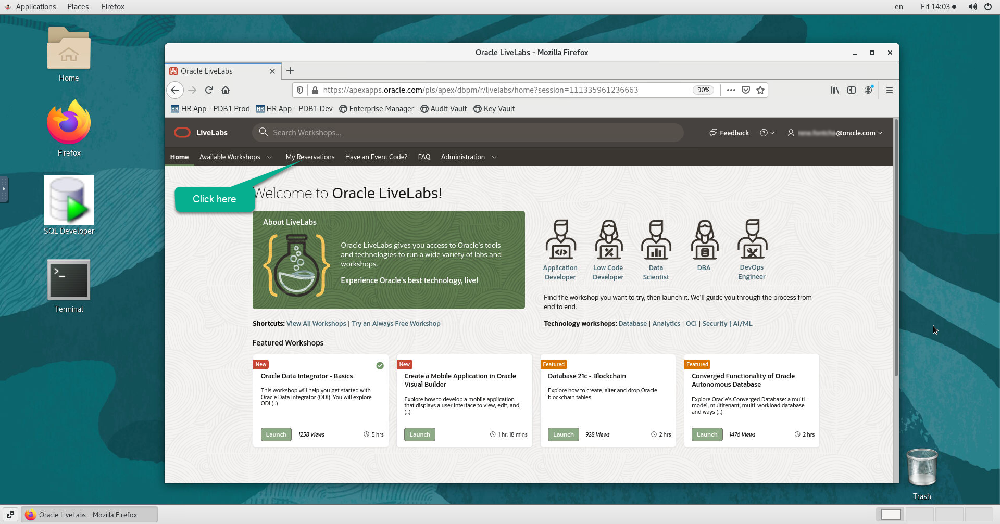
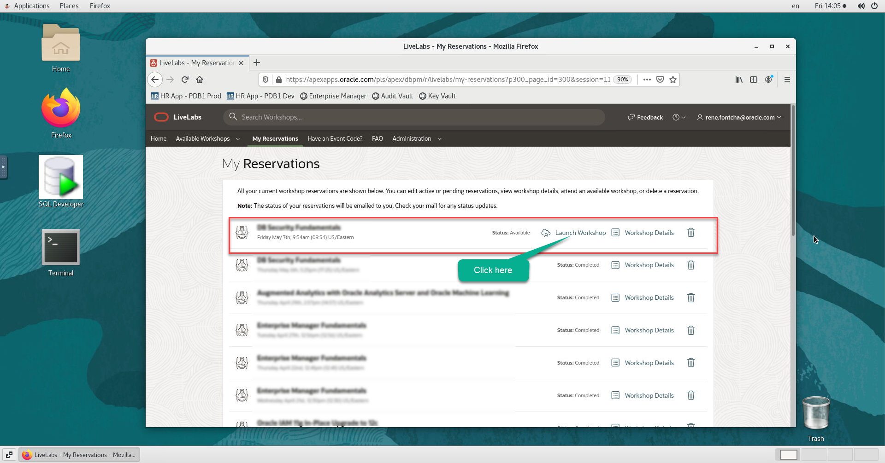
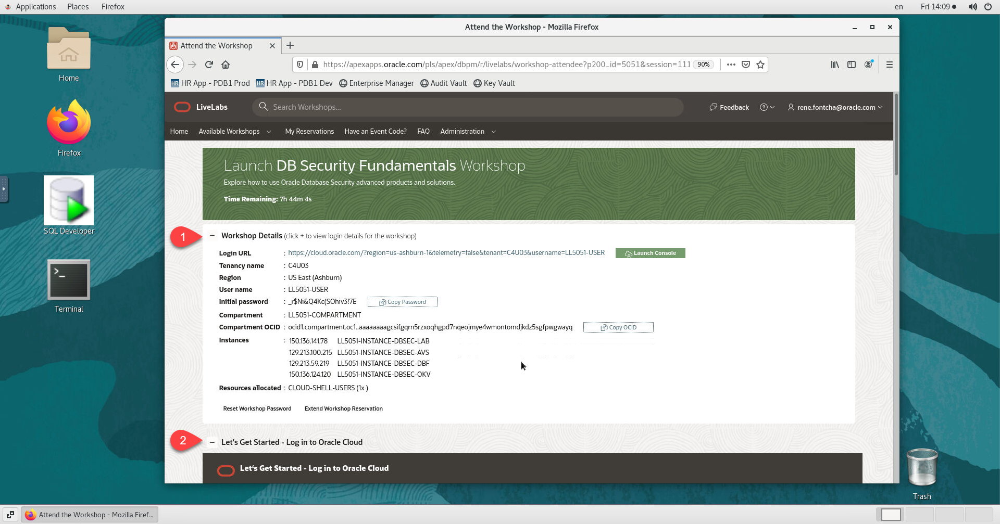
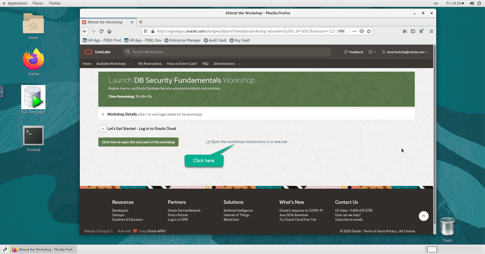
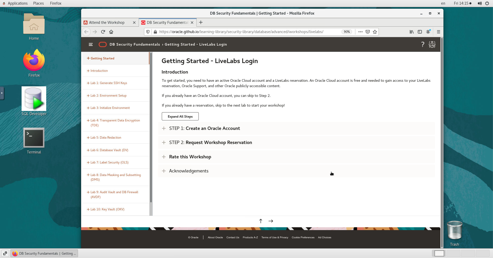

# Initialize Environment

## Introduction
This lab will show you how to access the Inmemory Lab environment and validate successful initialization

### Objectives
- Access remote desktop
- Enable remote clipboard  
- Validate successful initialization

### Prerequisites
This lab assumes you have:
- A Free Tier, Paid or LiveLabs Oracle Cloud account
- SSH Private Key to access the host via SSH
- You have completed:
    - Lab: Generate SSH Keys (*Free-tier* and *Paid Tenants* only)
    - Lab: Prepare Setup (*Free-tier* and *Paid Tenants* only)
    - Lab: Environment Setup

## **STEP 1:** Access the Graphical Remote Desktop (Preferred)
For ease of execution of this workshop, your InMemory VM instance has been pre-configured with a remote graphical desktop accessible using any modern browser on your laptop or workstation. Proceed as detailed below to login.

1. Launch your browser to the following URL

    ```
    <copy>http://[your instance public-ip address]/index.html?resize=remote</copy>
    ```

    


2. Copy/Paste the Password below to login

    ```
    <copy>IMworkshop2021#</copy>
    ```

    

3. Click on the *Firefox* browser icon from the remote desktop to launch it

    

## **STEP 2:** Enable Copy/Paste from Local to Remote Desktop (noVNC clipboard)
During the execution of your labs you may need to copy text from your local PC/Mac to the remote desktop, such as commands from the lab guide. While such direct copy/paste isn't supported as you will realize, you may proceed as indicated below to enable an alternative local-to-remote clipboard with Input Text Field.

1. From your remote desktop session, click on the small gray tab on the middle-left side of your screen to open the control bar

    

2. Select the *clipboard* icon, Copy the sample text below and paste into the clipboard widget, then finally open up the desired application and paste accordingly using *mouse controls*

    ```
    <copy>echo "This text was copied from my local computer"</copy>
    ```

    

    *Note:* Please make sure you initialize your clipboard with steps *[1-3]* shown above before opening the target application in which you intend to paste the text. Otherwise will find the *paste* function grayed out in step 4 when attempting to paste.

## **STEP 3:** Open Workshop Guide from the Remote Desktop
LiveLabs workshop guides make an extensive use of *Click-to-Copy* function, providing convenient and effective way to quickly copy a predefined text or block of text without the need to first highlight it. This also help avoid mistakes that may occur when doing it manually such as copying extra or fewer characters than intended.

As a result, launching your workshop guide from the remote desktop will further enhance your experience. It will greatly help speed up your labs execution by removing the need to constantly switch between the guide from your local computer and the remote desktop, and minimize the need for the 3-steps *copy/paste/paste* described in *STEP 2* above.

1. From your remote desktop session, launch *Firefox*, browse to *LiveLabs* if not already opened, then click on *Sign In*

    ```
    <copy>http://bit.ly/golivelabs</copy>
    ```

    

2. Provide your login credentials and click on *Sign In*

    

3. Click on *My Reservations*

    

4. Click on *Launch Workshop*

    

5. Click on *-* next to *Workshop Details* and *Let's Get Started* to collapse

    

6. Click on *Open the workshop instructions in a new tab*

    

    

## **STEP 4:** Login to Host using SSH Key Based Authentication (Optional)

While you will only need the browser to perform all tasks included in this workshop, you can optionally use your preferred SSH client to connect to the instance should you prefer to run SSH Terminal tasks from a local client (e.g. Putty, MobaXterm, MacOS Terminal, etc.) or need to perform any troubleshooting task such as restarting processes, rebooting the instance, or just look around.

Refer to *Lab Environment Setup* for detailed instructions relevant to your SSH client type (e.g. Putty on Windows or Native such as terminal on Mac OS):
 - Authentication OS User - “*opc*”
 - Authentication method - *SSH RSA Key*
 - OS User – “*oracle*”.

1. First login as “*opc*” using your SSH Private Key

2. Then sudo to “*oracle*”. E.g.

    ```
    <copy>sudo su - oracle</copy>
    ```

    *Note:* All screenshots for SSH terminal type tasks featured throughout this workshop were captured using the *MobaXterm* SSH Client as described in this step. As a result when executing such tasks from within the graphical remote desktop session you can skip steps requiring you to login as user *oracle* using *sudo su - oracle*, the reason being that the remote desktop session is under user *oracle*.

    You may now [proceed to the next lab](#next).

## Acknowledgements
- **Author** - Rene Fontcha, LiveLabs Platform Lead, NA Technology
- **Contributors** - Hakim Loumi
* **Last Updated By/Date** - Rene Fontcha, LiveLabs Platform Lead, NA Technology, May 2021
